# 🔄 Workflow for Updating `tfmigrate_stack_migration` Resource

This document describes the structured workflow for updating the tfmigrate_stack_migration resource within the Terraform Migrate Provider. This resource manages the migration of existing HCP Terraform workspaces to deployments inside a non-VCS stack.

The resource is configured using 11 parameters, categorized as Required, Optional, and Read-Only. Any modification to these parameters will trigger an update to the resource, which may lead to a re-evaluation of the migration process and potential updates to the stack deployments.

## Parameters Overview

### 🔑 Required Parameters

These parameters must be configured and identify the content and targets of the migration:

| Parameter                      | Type        | Description                                                                                                                                                                              |
|--------------------------------|-------------|------------------------------------------------------------------------------------------------------------------------------------------------------------------------------------------|
| `config_file_dir`              | string      | Absolute path to the directory containing the stack configuration files (the source bundle).                                                                                             |
| `name`                         | string      | Unique stack name (must be a non-VCS-driven stack).                                                                                                                                      |
| `terraform_config_dir`         | string      | Absolute path to the directory containing the Terraform configuration files used to generate stack deployments.                                                                          |
| `workspace_deployment_mapping` | map(string) | Mapping of Terraform workspace names (keys) to stack deployment names (values). Example: `workspace_deployment_mapping = { "workspace1" = "deployment1", "workspace2" = "deployment2" }` |

---

### ⚙️ Optional Parameters

These parameters define the location of the stack:

| Parameter      | Type   | Description                                                                                                                |
|----------------|--------|----------------------------------------------------------------------------------------------------------------------------|
| `organization` | String | The organization name. Required if the `TFE_ORGANIZATION` environment variable is not set. The attribute takes precedence. |
| `project`      | String | The project name. Required if the `TFE_PROJECT` environment variable is not set. The attribute takes precedence.           |

---

### 🔒 Read-Only Parameters

These parameters track the current state and hashes; they are updated by running terraform refresh.

| Parameter                      | Type   | Description                                                                                  |
|--------------------------------|--------|----------------------------------------------------------------------------------------------|
| `current_configuration_id`     | String | ID of the current stack configuration.                                                       |
| `current_configuration_status` | String | Status of the stack configuration upload.                                                    |
| `migration_hash`               | String | Hash used for tracking the migration state.                                                  |
| `source_bundle_hash`           | String | Hash of the configuration files in `config_file_dir`. Used to detect changes.                |
| `terraform_config_hash`        | String | Hash of the Terraform configuration files in `terraform_config_dir`. Used to detect changes. |

---

## 🔨 Update Workflow Based on Parameter Changes

The update workflow is determined by which parameters are modified.

---

### 1. Stack Identity Changes

If any of the stack identifying parameters are modified, a `destroy and recreate` of the resource is triggered:

- `name`
- `organization`
- `project`

---

### 2. Configuration, Mapping, or File Hash Changes

If any of the following parameters are modified, the provider follows a complex evaluation chain to determine the appropriate action:

- `config_file_dir`
- `terraform_config_dir`
- `workspace_deployment_mapping`
- `source_bundle_hash` (Changed by file modification in `config_file_dir`)

The provider first evaluates the following internal states to decide if the modification is allowed:

- The status of the prior configuration determined by `current_configuration_id`.
- The status of the deployments associated with the configuration determined by `current_configuration_status`.
- The `migration_hash`, `source_bundle_hash`, and `workspace_deployment_mapping` to detect specific changes.

---

### A. Modification Allowed Conditions

A modification to `source_bundle_hash` or `workspace_deployment_mapping` is allowed if one of the following is true:

- The prior configuration is in a failed state.
- The prior configuration is in a successful state, and all deployments are in non-transiting states (meaning they are all successful, all failed, or a mix of successful/failed, but none are currently transitioning).

If these conditions are not met, the modification is not allowed, an error is raised, and a `waitForDeploymentsCompletion` is triggered to ensure all deployments reach a terminal state before the update can proceed.

---

### B. Update Actions Based on State

If the modification is allowed, the provider then selects one of three actions based on the state of the prior configuration and deployments:

| Condition Set | Prior Configuration State | Deployment States                        | Change Detected                                                     | Action Triggered              |
|---------------|---------------------------|------------------------------------------|---------------------------------------------------------------------|-------------------------------|
| Set 1         | Failed                    | All non-transiting (Success/Failed mix)  | Any change or No change (Forces Re-Apply)                           | `applyNewConfiguration`       |
| Set 2a        | Successful                | All non-transiting: All Successful       | `source_bundle_hash` or workspace_deployment_mapping changed        | `applyNewConfiguration`       |
| Set 2b        | Successful                | All non-transiting: All Failed           | Any change or No change (Forces Re-Apply)                           | `applyNewConfiguration`       |
| Set 3a        | Successful                | All non-transiting: Mixed Success/Failed | `source_bundle_hash` or `workspace_deployment_mapping` changed      | `applyNewConfiguration`       |
| Set 3b        | Successful                | All non-transiting: Mixed Success/Failed | No change in `source_bundle_hash` or `workspace_deployment_mapping` | `retryFailedDeployments`      |
| Set 4         | Successful                | All Successful                           | No change in `source_bundle_hash` or `workspace_deployment_mapping` | `noAction` (Idempotent state) |

---

### 3. Workflow for Read-Only Parameters

The values of the read-only parameters reflect the state in HCP Terraform and are updated manually by the user:

- **`terraform refresh`:** Run this command to sync the local state with the actual stack state in HCP Terraform.  
  *Note: When `terraform refresh` updates `current_configuration_id`, `current_configuration_status`, or migration_hash, the subsequent `terraform apply` will evaluate the conditions in Section 2B to determine the necessary update action.*

- **`terraform plan`:** Run this command to see if any changes are required based on the newly updated state.

- **`terraform apply`:** Proceed with this command if changes are needed.

---
## ⚙️ Update Action Flowchart of `tfmigrate_stack_migration`

```mermaid
flowchart LR

%% =========================
%% Terraform Purple (Muted Professional) Theme
%% =========================
classDef decision fill:#F4ECFF,stroke:#6B3AA8,stroke-width:2px,color:#3A1C66;
classDef action fill:#F8F1FF,stroke:#6B3AA8,stroke-width:2px,color:#3A1C66;
classDef error fill:#FDEAEA,stroke:#C53030,stroke-width:2px,color:#3A0D0D;
classDef info fill:#F3F3F7,stroke:#6D6D7F,stroke-width:1.4px,color:#272733;

%% Inline code accent color: #7F7CFF

%% =========================
%% LEGEND — FLOATING, BOXED, HORIZONTAL, LABELED
%% =========================
subgraph Legend [Legend]

LG_DECISION{Decision}:::decision
LG_ACTION([ Action / Outcome]):::action
LG_ERROR> Error State]:::error
LG_INFO[Info]:::info
end

%% Invisible arrow from A to Legend (positions correctly, shows no arrow)
%% done for alignment purposes only
Legend ~~~~ C3 

%% =========================
%% Entry
%% =========================
A[Parameter Modified?] --> B{Which Parameter Changed?}

%% =========================
%% Parameter Categories (Top Row)
%% =========================
B --> C1["Stack Identity Parameters:
<div style='text-align:left'>
<ul>
<li><code style='color:#7F7CFF'>name</code></li>
<li><code style='color:#7F7CFF'>organization</code></li>
<li><code style='color:#7F7CFF'>project</code></li>
</ul>
</div>
"]

B --> C2["Config / Mapping / Hash Parameters:
<div style='text-align:left'>
<ul>
<li><code style='color:#7F7CFF'>config_file_dir</code></li>
<li><code style='color:#7F7CFF'>terraform_config_dir</code></li>
<li><code style='color:#7F7CFF'>workspace_deployment_mapping</code></li>
<li><code style='color:#7F7CFF'>source_bundle_hash</code></li>
<li><code style='color:#7F7CFF'>terraform_config_hash</code></li>
</ul>
</div>
"]

B --> C3["Read-Only Parameters:
<div style='text-align:left'>
<ul>
<li><code style='color:#7F7CFF'>current_configuration_id</code></li>
<li><code style='color:#7F7CFF'>current_configuration_status</code></li>
<li><code style='color:#7F7CFF'>migration_hash</code></li>
</ul>
</div>
"]

%% =========================
%% Identity Path
%% =========================
C1 --> D1([Trigger Destroy and Recreate]):::action

%% =========================
%% Read-Only Path
%% =========================
C3 --> D3([Run <code style='color:#7F7CFF'>terraform refresh</code><br>State synced from HCP Terraform]):::action
D3 --> E3([Run <code style='color:#7F7CFF'> terraform apply</code><br> Trigger condition re-evaluation]):::action
E3 --> H

%% =========================
%% Config / Hash Path
%% =========================
C2 --> F{Modification Allowed?}:::decision

F -->|YES| H

%% =========================
%% Evaluation Hub
%% =========================
H{Evaluate Prior Configuration<br>and Deployment States}:::decision

%% =========================
%% Outcomes
%% =========================

H -->|Prior Config Failed<br>All Non-Transitioning| S1([<code style='color:#7F7CFF'>applyNewConfiguration</code>]):::action

H -->|All Successful<br>Change Detected| S2A([<code style='color:#7F7CFF'>applyNewConfiguration</code>]):::action

H -->|All Failed<br>Any or No Change| S2B([<code style='color:#7F7CFF'>applyNewConfiguration</code>]):::action

H -->|Mixed Success/Failed<br>Change Detected| S3A([<code style='color:#7F7CFF'>applyNewConfiguration</code>]):::action

H -->|Mixed Success/Failed<br>No Change| S3B([<code style='color:#7F7CFF'>retryFailedDeployments</code>]):::action

H -->|All Successful<br>No Change| S4(["<code style='color:#7F7CFF'>noAction</code> (Idempotent State)"]):::action


F -->|NO| G1>Error Raised<br><code style='color:#7F7CFF'>waitForDeploymentsCompletion</code><br>Wait for terminal states]:::error

%% =========================
%% Class Assignments
%% =========================
class B,F,H decision;
class D1,D3,E3,S1,S2A,S2B,S3A,S3B,S4 action;
class G1 error;
class C1,C2,C3,A info;
```

---